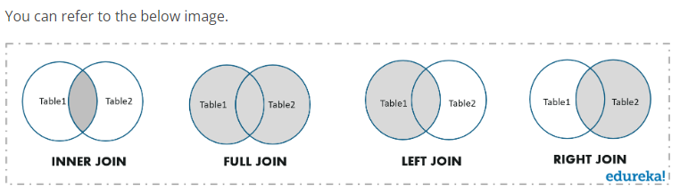

# SQL Process:
  
When you are executing an SQL command for any RDBMS, the system determines the best way to carry out your
request and SQL engine figures out how to interpret the task.
There are various components included in the process. These components are Query Dispatcher, Optimization
Engines, Classic Query Engine and SQL Query Engine, etc. 
Classic query engine handles all non-SQL queries, but SQL query engine won't handle logical files.

 -> Following is a simple diagram showing SQL Architecture:

# What is a Schema in SQL Server?
A Schema in SQL is a collection of database objects associated with a database. The username of a database is called a Schema owner (owner of logically grouped structures of data). Schema always belong to a single database whereas a database can have single or multiple schemas. Also, it is also very similar to separate namespaces or containers, which stores database objects. It includes various database objects including your tables,  views, procedures, index, etc.

# How to create a Schema?

# What are Joins?
JOINS in SQL are commands which are used to combine rows from two or more tables, based on a related column between those tables.  There are predominantly used when a user is trying to extract data from tables which have one-to-many or many-to-many relationships between them.

Now, that you know what joins mean, let us next learn the different types of joins.

# How many types of Joins are there in SQL?
There are mainly four types of joins that you need to understand. They are:

*INNER JOIN

*FULL JOIN

*LEFT JOIN

*RIGHT JOIN

 
